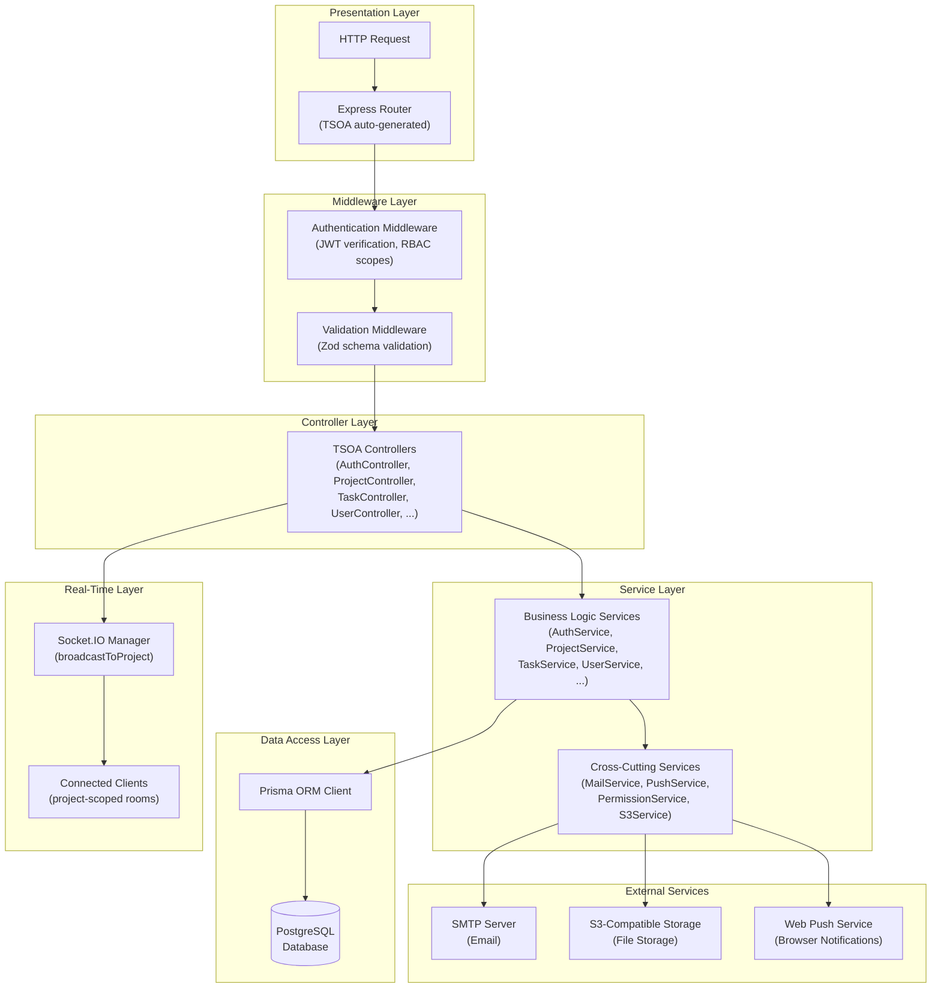

# nexTask — Class Diagram

This document contains the UML class diagram for the nexTask backend architecture, showing the relationships between controllers, services, middlewares, and utility classes.

---

## Backend Architecture Class Diagram

```mermaid
classDiagram
    direction TB

    %% ─── Controllers ───────────────────────────────────────────────
    class AuthController {
        -authService: AuthService
        +login(body: LoginRequest): LoginResponseWrapper
        +resetPassword(body: ResetPasswordRequest, request): LoginResponseWrapper
        +refreshSession(request): LoginResponseWrapper
        +forgotPassword(body: ForgotPasswordRequest): VoidResponse
        +selfResetPassword(body: ForgotPasswordResetRequest): VoidResponse
    }

    class ProjectController {
        -projectService: ProjectService
        +create(body: CreateProjectRequest, request): ProjectResponse
        +getAll(request): ProjectListResponse
        +getMyProjects(request): ProjectListResponse
        +getAdminAllProjects(request): ProjectListResponse
        +getById(id: string): ProjectResponse
        +update(id: string, body: UpdateProjectRequest): ProjectResponse
        +complete(id: string): ProjectResponse
        +archive(id: string): ProjectResponse
        +delete(id: string): VoidResponse
    }

    class TaskController {
        +getTasksMe(request): TaskListResponse
        +getTasksAdmin(request): TaskListResponse
        +getTasksByProject(projectId, request, search?, status?, priority?, tags?): TaskListResponse
        +getTask(id: string, request): TaskResponse
        +createNewTask(body: CreateTaskRequest, request): TaskResponse
        +updateExistingTask(id, body: UpdateTaskRequest, request): TaskResponse
        +deleteExistingTask(id: string, request): VoidResponse
    }

    class UserController {
        -userService: UserService
        +getUserAutocomplete(projectId, q): UserListResponse
        +getMe(request): UserProfileResponse
        +updateMe(body, request): UserProfileResponse
        +changePassword(body, request): VoidResponse
        +getMyProjects(request): ProjectListResponse
        +listUsers(request, page, limit, search?): PaginatedUsersResponseWrapper
        +createUser(body, request): UserCreateResponse
        +getUserById(id): UserProfileResponse
        +updateUser(id, body, request): UserProfileResponse
        +deactivateUser(id, request): UserProfileResponse
        +activateUser(id, request): UserProfileResponse
        +deleteUser(id, request): VoidResponse
        +requestPasswordReset(id, request): VoidResponse
        +getUserActivity(id): UserActivityListResponse
    }

    class ProjectMemberController {
        +addMember(id, body, request): ProjectMemberResponse
        +getMembers(id): ProjectMemberViewListResponse
        +getMemberDetails(id, userId): ProjectMemberViewResponse
        +assignProjectManager(id, userId, request): ProjectMemberViewResponse
        +assignCollaborator(id, userId, request): ProjectMemberViewResponse
        +updateMemberRole(id, userId, body, request): ProjectMemberViewResponse
        +removeMember(id, userId, request): VoidResponse
    }

    class TaskAssignmentController {
        +assignUser(id, body, request): TaskAssigneeListResponse
        +unassignUser(id, userId, request): VoidResponse
        +bulkAssign(id, body, request): TaskAssigneeListResponse
        +getAssignees(id): TaskAssigneeListResponse
    }

    class CommentController {
        +getComments(taskId): CommentListResponse
        +createComment(taskId, body, request): CommentResponse
    }

    class AttachmentController {
        +getTaskAttachments(taskId): AttachmentListResponse
        +uploadAttachment(taskId, body, request): AttachmentResponse
        +deleteAttachment(attachmentId, request): VoidResponse
    }

    class NotificationController {
        +getNotifications(request): NotificationListResponse
        +markAsRead(id, request): NotificationResponse
        +markAllRead(request): VoidResponse
    }

    class MessageController {
        +getMessages(projectId): MessageListResponse
    }

    class PushController {
        +subscribe(body, request): VoidResponse
        +unsubscribe(body, request): VoidResponse
    }

    class SystemController {
        +health(): SystemHealthResponse
        +getPublicKey(): SystemPublicKeyResponse
    }

    %% ─── Services ──────────────────────────────────────────────────
    class AuthService {
        +login(data: LoginRequest): LoginResponse
        +resetPassword(userId, data: ResetPasswordRequest): LoginResponse
        +refreshSession(userId): LoginResponse
        +forgotPassword(email): void
        +selfResetPassword(data: ForgotPasswordResetRequest): void
    }

    class ProjectService {
        +createProject(name, description, ownerId, endDate?): Project
        +getAllProjects(requestorId, requestorRole): Project[]
        +getProjectById(id): Project
        +updateProject(id, name, description): Project
        +completeProject(id): Project
        +archiveProject(id): Project
        +deleteProject(id): void
    }

    class TaskService {
        +createTask(data): Task
        +getAllTasks(projectId, userId, role, search?, status?, priority?, tags?): Task[]
        +getMyTasks(userId): Task[]
        +getAdminAllTasks(userId): Task[]
        +getTaskById(id, userId?, role?): Task
        +updateTask(id, data, userId): Task
        +deleteTask(id, userId): void
    }

    class UserService {
        +getProfile(userId): UserProfile
        +updateProfile(userId, data): UserProfile
        +changePassword(userId, data): void
        +getUserProjects(userId): Project[]
        +listUsers(page, limit, search?): PaginatedUsersResponse
        +createUser(data, actorId): CreateUserResponse
        +updateUser(id, data, actorId): UserProfile
        +deactivateUser(id, actorId): UserProfile
        +activateUser(id, actorId): UserProfile
        +deleteUser(id, actorId): void
        +adminResetPassword(id, actorId): void
        +getUserActivity(id): UserActivityResponse[]
        +searchUsersAutocomplete(projectId, query): User[]
    }

    class ProjectMemberService {
        +addMember(projectId, userId, role, actorId): ProjectMember
        +getMembers(projectId): ProjectMemberView[]
        +getMemberDetails(projectId, userId): ProjectMemberView
        +updateMemberRole(projectId, userId, role, actorId): ProjectMemberView
        +removeMember(projectId, userId, actorId): void
    }

    class TaskAssignmentService {
        +assignUser(taskId, userId, actorId): TaskAssignee[]
        +unassignUser(taskId, userId, actorId): void
        +bulkAssign(taskId, userIds, actorId): TaskAssignee[]
        +getAssignees(taskId): TaskAssignee[]
    }

    class CommentService {
        +postComment(userId, taskId, content, attachments?): Comment
        +getCommentsByTaskId(taskId): Comment[]
        +deleteComment(commentId, userId, role): string
    }

    class AttachmentService {
        +createAttachment(taskId, data, userId): Attachment
        +getAttachmentsByTaskId(taskId): Attachment[]
        +deleteAttachment(id, userId, role): void
    }

    class MailService {
        +sendWelcomeEmail(email, name, tempPassword): void
        +sendForgotPasswordEmail(email, name, resetLink): void
        +sendPasswordResetNotification(email, name): void
        +sendTaskAssignmentEmail(email, name, taskTitle, projectName): void
        +sendProjectAddedEmail(email, name, projectName, role): void
        +sendProjectRemovedEmail(email, name, projectName): void
        +sendProjectRoleUpdatedEmail(email, name, projectName, oldRole, newRole): void
        +sendUserStatusChangedEmail(email, name, isActive): void
        +sendUserRemovedEmail(email, name): void
    }

    class NotificationService {
        +createNotification(userId, message, type, taskId?): Notification
        +getNotifications(userId): Notification[]
        +markAsRead(id, userId): Notification
        +markAllRead(userId): void
    }

    class MessageService {
        +getMessages(projectId): Message[]
        +createMessage(projectId, senderId, content, attachments?): Message
    }

    class PushService {
        +subscribe(userId, subscription): void
        +unsubscribe(userId, endpoint): void
        +sendPushNotification(userId, title, body): void
    }

    class S3Service {
        +getPresignedUploadUrl(fileKey, mimeType): string
        +getPresignedDownloadUrl(fileKey): string
        +deleteObject(fileKey): void
    }

    class PermissionService {
        +canPerformAction(userId, role, projectId, action, task?)$: boolean
    }

    %% ─── Middleware ────────────────────────────────────────────────
    class AuthenticationMiddleware {
        +expressAuthentication(request, securityName, scopes?): JWTPayload
        -getProjectIdFromRequest(request): string
    }

    class ValidateMiddleware {
        +validateRequest(schema: ZodType): ExpressMiddleware
    }

    %% ─── Utils ─────────────────────────────────────────────────────
    class ApiError {
        +statusCode: number
        +message: string
        +constructor(statusCode, message)
    }

    class ResponseUtil {
        +successResponse(message, data): ApiResponse$
        +errorResponse(message, errors?): ApiResponse$
    }

    class HashUtil {
        +hashPassword(password): string$
        +verifyPassword(hash, password): boolean$
    }

    class JWTUtil {
        +generateToken(payload): string$
        +verifyToken(token): JWTPayload$
    }

    %% ─── Lib ───────────────────────────────────────────────────────
    class SocketManager {
        +initSocket(server): void$
        +broadcastToProject(projectId, event, data): void$
    }

    class PrismaClient {
        +user: UserDelegate
        +project: ProjectDelegate
        +task: TaskDelegate
        +comment: CommentDelegate
        +attachment: AttachmentDelegate
        +notification: NotificationDelegate
        +pushSubscription: PushSubscriptionDelegate
        +taskActivity: TaskActivityDelegate
        +message: MessageDelegate
    }

    %% ─── Controller → Service Relationships ────────────────────────
    AuthController --> AuthService
    ProjectController --> ProjectService
    TaskController --> TaskService
    TaskController --> PermissionService
    UserController --> UserService
    CommentController --> CommentService
    AttachmentController --> AttachmentService
    NotificationController --> NotificationService
    MessageController --> MessageService
    PushController --> PushService

    %% ─── Service → Service Dependencies ────────────────────────────
    AuthService --> MailService
    UserService --> MailService
    ProjectMemberService --> MailService
    ProjectMemberService --> NotificationService
    TaskAssignmentService --> MailService
    TaskAssignmentService --> NotificationService
    TaskAssignmentService --> PushService
    CommentService --> S3Service
    AttachmentService --> S3Service
    AuthService --> HashUtil
    AuthService --> JWTUtil

    %% ─── Controller → Middleware Dependencies ──────────────────────
    AuthController ..> AuthenticationMiddleware : "uses @Security"
    ProjectController ..> ValidateMiddleware : "uses @Middlewares"
    TaskController ..> ValidateMiddleware : "uses @Middlewares"
    UserController ..> ValidateMiddleware : "uses @Middlewares"
    CommentController ..> ValidateMiddleware : "uses @Middlewares"

    %% ─── Controller → Socket Dependencies ──────────────────────────
    TaskController ..> SocketManager : "broadcasts events"
    CommentController ..> SocketManager : "broadcasts events"
    TaskAssignmentController ..> SocketManager : "broadcasts events"

    %% ─── Utils Usage ───────────────────────────────────────────────
    ProjectController ..> ApiError : "throws"
    TaskController ..> ApiError : "throws"

    %% ─── All Services → PrismaClient ───────────────────────────────
    AuthService --> PrismaClient
    ProjectService --> PrismaClient
    TaskService --> PrismaClient
    UserService --> PrismaClient
    CommentService --> PrismaClient
    AttachmentService --> PrismaClient
    NotificationService --> PrismaClient
    MessageService --> PrismaClient
    PushService --> PrismaClient
    PermissionService --> PrismaClient
```

---

## Architecture Layers

The backend follows a **layered architecture** pattern:

