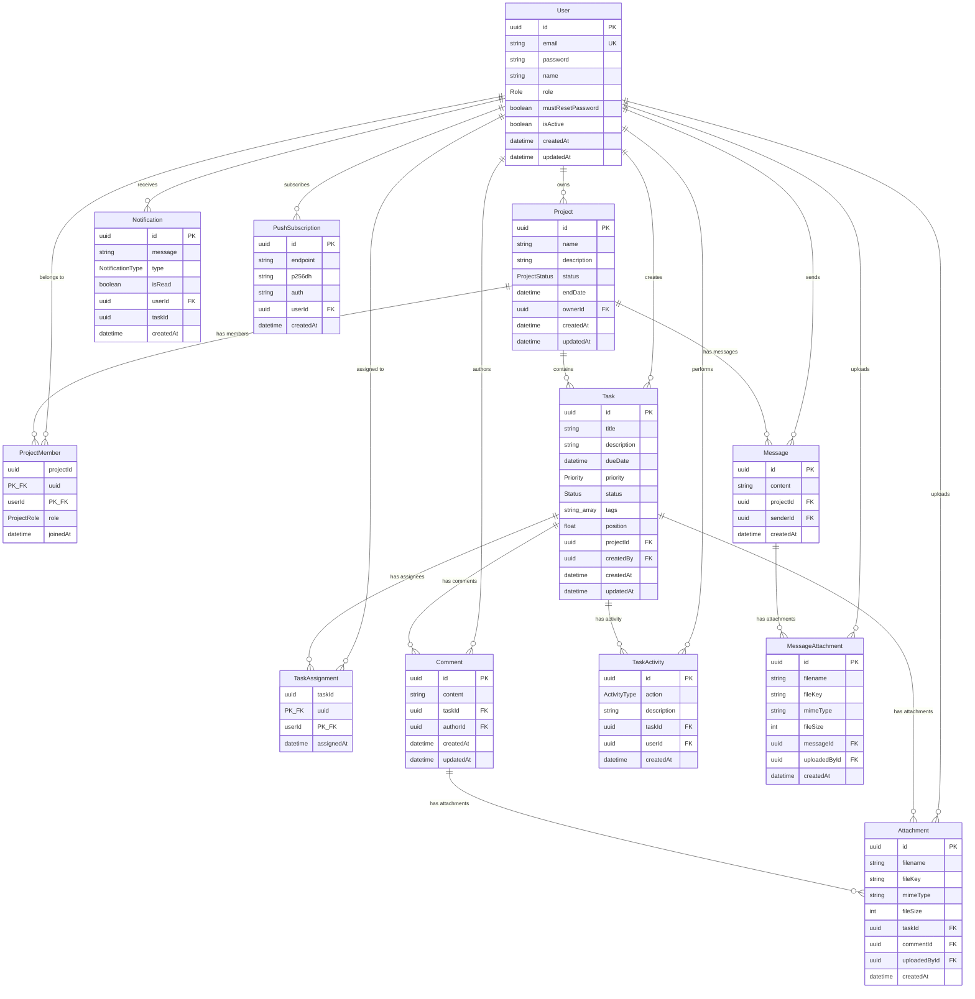

# nexTask — Database Design Document

This document describes the database schema for the nexTask Task Management System, implemented using **PostgreSQL** via **Prisma ORM**.

---

## Database Overview

The database consists of **11 tables** and **7 enums** that model the complete task management domain including users, projects, tasks, collaboration (comments, attachments), notifications, messaging, and audit trails.

---

## Entity-Relationship Diagram

---

## Enum Definitions

### Role (Global User Roles)
| Value | Description |
|-------|-------------|
| `ADMIN` | System-wide administrator with full access |
| `PROJECT_MANAGER` | Can create and manage projects |
| `COLLABORATOR` | Can participate in assigned projects and tasks |

### ProjectRole (Project-Level Roles)
| Value | Description |
|-------|-------------|
| `PROJECT_MANAGER` | Manages tasks and members within a specific project |
| `COLLABORATOR` | Contributes to tasks within a specific project |

### ProjectStatus
| Value | Description |
|-------|-------------|
| `ACTIVE` | Project is currently in progress |
| `ARCHIVED` | Project has been archived for reference |
| `COMPLETED` | Project has been marked as completed |

### Priority (Task Priority Levels)
| Value | Description |
|-------|-------------|
| `LOW` | Low priority task |
| `MEDIUM` | Medium priority task (default) |
| `HIGH` | High priority task |

### Status (Task Status)
| Value | Description |
|-------|-------------|
| `TODO` | Task has not been started |
| `IN_PROGRESS` | Task is currently being worked on |
| `DONE` | Task has been completed |

### NotificationType
| Value | Description |
|-------|-------------|
| `TASK_ASSIGNED` | User was assigned to a task |
| `STATUS_CHANGED` | A task's status was changed |
| `DEADLINE_ALERT` | Task deadline is approaching |
| `COMMENT_ADDED` | New comment was posted on a task |
| `ADMIN_UPDATE` | Administrative action was performed |
| `CHAT_MESSAGE` | New chat message in project |
| `PROJECT_ADDED` | User was added to a project |

### ActivityType (Audit Log Actions)
| Value | Description |
|-------|-------------|
| `TASK_CREATED` | A task was created |
| `TASK_UPDATED` | A task was updated |
| `TASK_DELETED` | A task was deleted |
| `TASK_STATUS_CHANGED` | A task's status was changed |
| `TASK_ASSIGNED` | A user was assigned to a task |
| `TASK_COMMENT_ADDED` | A comment was added |
| `TASK_COMMENT_UPDATED` | A comment was updated |
| `TASK_COMMENT_DELETED` | A comment was deleted |
| `TASK_ATTACHMENT_ADDED` | An attachment was added |
| `TASK_ATTACHMENT_DELETED` | An attachment was deleted |
| `USER_CREATED` | A user account was created |
| `USER_UPDATED` | A user account was updated |
| `USER_DELETED` | A user account was deleted |
| `USER_DEACTIVATED` | A user account was deactivated |
| `USER_ACTIVATED` | A user account was activated |
| `ROLE_CHANGED` | A user's role was changed |

---

## Table Relationships Summary

| Relationship | Type | Cascade Delete |
|-------------|------|----------------|
| User → Project (owner) | One-to-Many | No |
| User → ProjectMember | One-to-Many | Yes |
| User → Task (creator) | One-to-Many | No |
| User → TaskAssignment | One-to-Many | Yes |
| User → Comment | One-to-Many | Yes |
| User → Attachment | One-to-Many | Yes |
| User → Notification | One-to-Many | Yes |
| User → PushSubscription | One-to-Many | Yes |
| User → TaskActivity | One-to-Many | Set Null |
| User → Message | One-to-Many | Yes |
| User → MessageAttachment | One-to-Many | Yes |
| Project → ProjectMember | One-to-Many | Yes |
| Project → Task | One-to-Many | Yes |
| Project → Message | One-to-Many | Yes |
| Task → TaskAssignment | One-to-Many | Yes |
| Task → Comment | One-to-Many | Yes |
| Task → Attachment | One-to-Many | Yes |
| Task → TaskActivity | One-to-Many | Yes |
| Comment → Attachment | One-to-Many | Yes |
| Message → MessageAttachment | One-to-Many | Yes |

---

## Indexes

| Table | Index | Purpose |
|-------|-------|---------|
| ProjectMember | `userId` | Fast lookup of user's project memberships |
| Task | `projectId` | Fast retrieval of project tasks |
| Task | `status, position` | Kanban board ordering |
| Comment | `taskId` | Fast retrieval of task comments |
| Comment | `authorId` | Fast lookup by comment author |
| Attachment | `taskId` | Fast retrieval of task attachments |
| Attachment | `commentId` | Fast retrieval of comment attachments |
| Attachment | `uploadedById` | Fast lookup by uploader |
| Notification | `userId` | Fast retrieval of user notifications |
| Notification | `isRead` | Filter read/unread notifications |
| PushSubscription | `userId` | Fast retrieval of user push subscriptions |
| TaskActivity | `taskId` | Fast retrieval of task audit logs |
| TaskActivity | `userId` | Fast retrieval of user audit logs |
| Message | `projectId` | Fast retrieval of project messages |
| Message | `senderId` | Fast lookup by sender |
| MessageAttachment | `messageId` | Fast retrieval of message attachments |
| MessageAttachment | `uploadedById` | Fast lookup by uploader |
