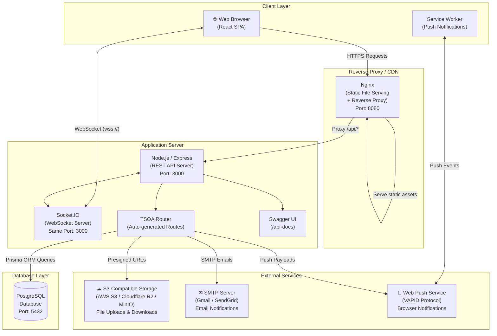
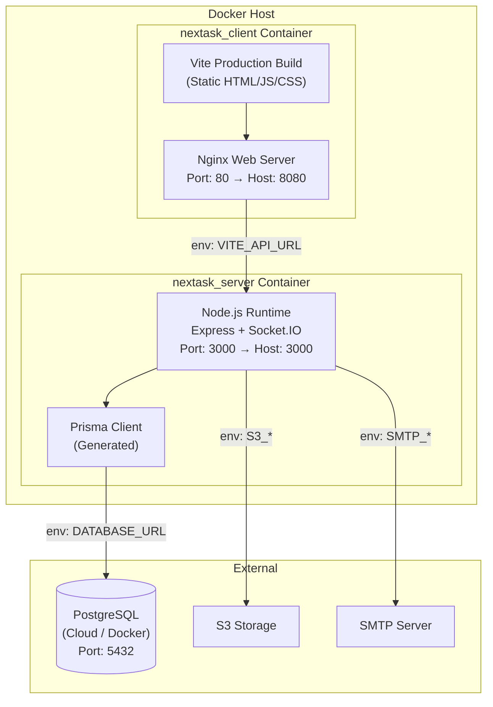
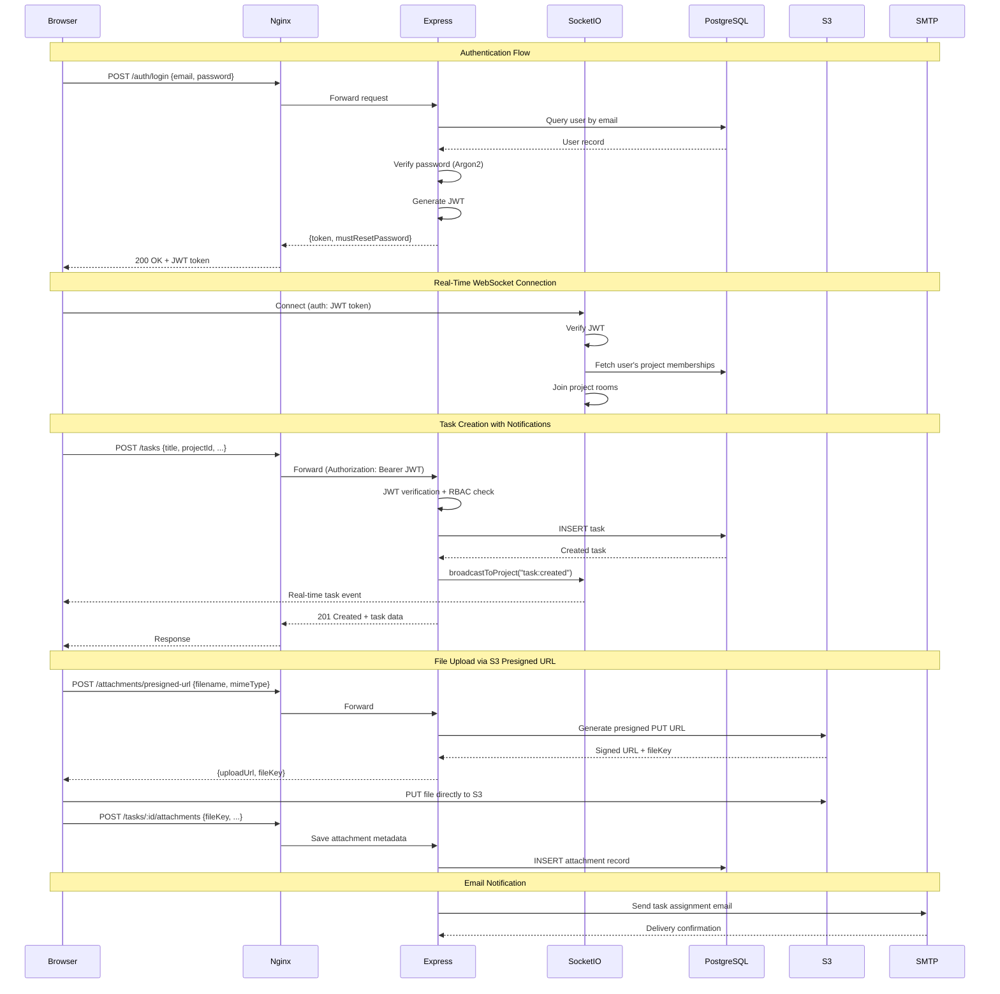
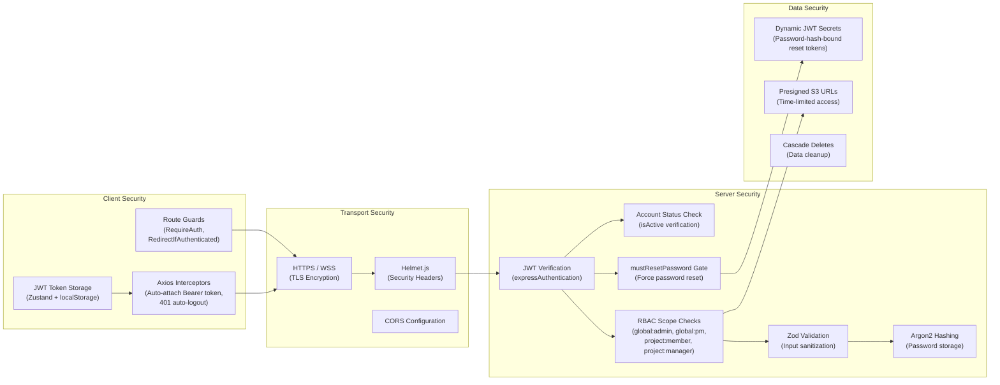

# nexTask — Deployment Diagram

This document describes the deployment architecture for the nexTask application, showing how components are deployed, containerized, and how they communicate.

---

## Production Deployment Architecture

---

## Docker Deployment Architecture

### Docker Services Configuration

| Container | Image Base | Exposed Port | Environment |
|-----------|------------|-------------|-------------|
| `nextask_server` | Node.js Alpine | `3000:3000` | `server/.env` |
| `nextask_client` | Nginx Alpine | `8080:80` | `client/.env` |

---

## Network Communication Flow

---

## Component Deployment Mapping

| Component | Technology | Deployment Target | Notes |
|-----------|-----------|-------------------|-------|
| Frontend SPA | React + Vite | Nginx container / CDN | Static assets served via Nginx |
| REST API | Express + TSOA | Node.js container | Auto-generated routes & Swagger |
| WebSocket Server | Socket.IO | Same Node.js container | Shares port with Express |
| Database | PostgreSQL | Managed DB / Docker | Prisma ORM handles migrations |
| File Storage | AWS SDK | AWS S3 / Cloudflare R2 / MinIO | Presigned URL pattern |
| Email Service | Nodemailer | External SMTP | Gmail App Passwords / SendGrid |
| Push Notifications | web-push | Web Push Protocol (VAPID) | Browser Service Worker |
| API Documentation | Swagger UI | Served by Express at `/api-docs` | Auto-generated from TSOA |

---

## Security Architecture

---

## Environment Configuration

| Environment | Frontend URL | Backend URL | Database |
|-------------|-------------|-------------|----------|
| Development | `http://localhost:5173` | `http://localhost:3000` | Local PostgreSQL |
| Docker | `http://localhost:8080` | `http://localhost:3000` | Container / Cloud |
| Production | Custom domain | Custom domain | Managed PostgreSQL (Supabase, AWS RDS, etc.) |
