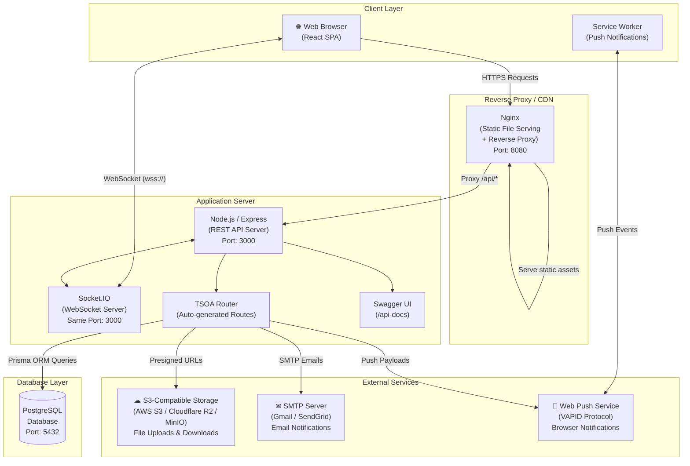
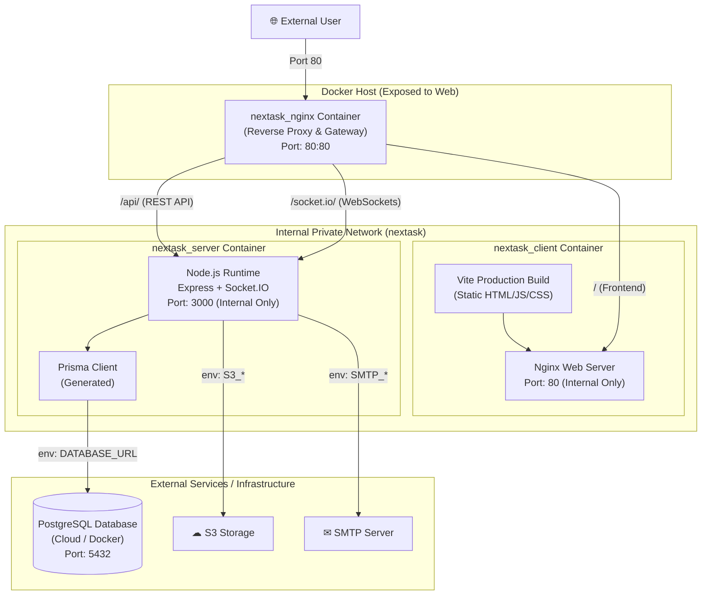
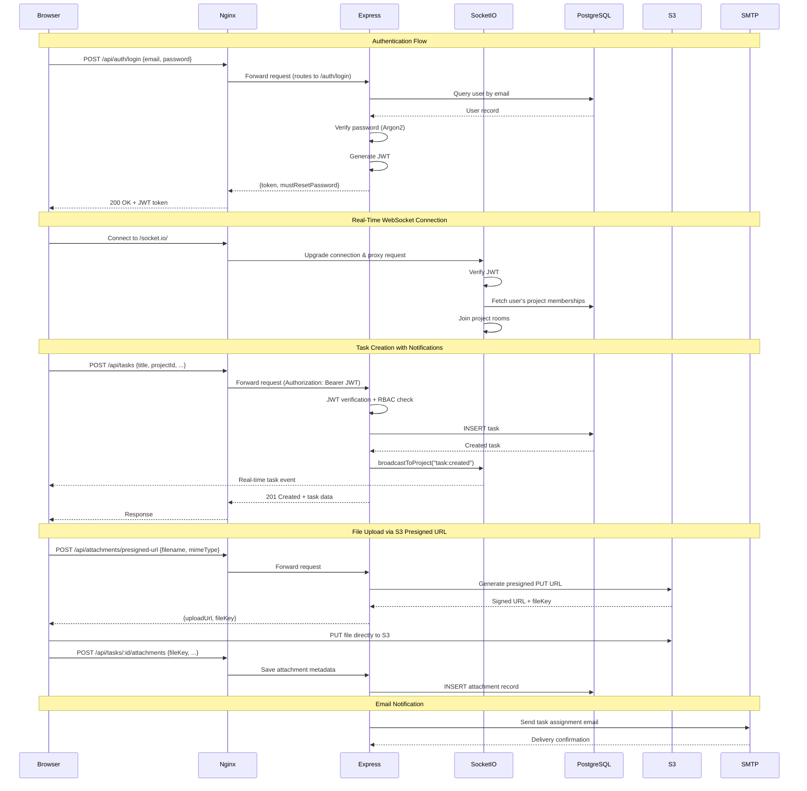

# nexTask — Deployment Diagram

This document describes the deployment architecture for the nexTask application, showing how components are deployed, containerized, and how they communicate.

---

## Production Deployment Architecture



---

## Docker Deployment Architecture



### Docker Services Configuration

| Container        | Service Name | Image Source (Prod) / Dockerfile (Dev)         | Exposed Port (Host) | Internal Port (Bridge) | Purpose                                             |
| :--------------- | :----------- | :--------------------------------------------- | :------------------ | :--------------------- | :-------------------------------------------------- |
| `nextask_nginx`  | `nginx`      | `nginx:alpine`                                 | `80:80`             | `80`                   | Unified gateway, reverse proxy, and SSL/HTTP router |
| `nextask_client` | `client`     | `ghcr.io/sasivarnasarma/nextask-client:latest` | _None_              | `80`                   | Serves static React frontend assets                 |
| `nextask_server` | `server`     | `ghcr.io/sasivarnasarma/nextask-server:latest` | _None_              | `3000`                 | Node.js Express REST API and Socket.IO server       |

---

## Network Communication Flow



---

## Component Deployment Mapping

| Component          | Technology     | Deployment Target               | Notes                                                           |
| :----------------- | :------------- | :------------------------------ | :-------------------------------------------------------------- |
| Unified Gateway    | Nginx          | Docker Container                | Single entry point on port 80 routing all traffic               |
| Frontend SPA       | React + Vite   | Docker Container (Nginx)        | Static assets served via internal Nginx inside client container |
| REST API           | Express + TSOA | Docker Container (Node.js)      | Auto-generated routes and Swagger UI available at `/api-docs`   |
| WebSocket Server   | Socket.IO      | Same Docker Container (Node.js) | Integrates with Express server, sharing port 3000 internally    |
| Database           | PostgreSQL     | Managed Cloud DB / Container    | Prisma ORM handles schemas and seeding operations               |
| File Storage       | AWS SDK        | AWS S3 / Cloudflare R2 / MinIO  | Direct client-to-cloud uploads via presigned URLs               |
| Email Service      | Nodemailer     | External SMTP Service           | Offloaded transactional emails (Gmail, SendGrid, etc.)          |
| Push Notifications | web-push       | Web Push Protocol (VAPID)       | Managed by service worker for offline event delivery            |

---

## Continuous Integration & Continuous Deployment (CI/CD)

The nexTask project incorporates a fully automated, multi-phase CI/CD workflow driven by **GitHub Actions** to compile, test, containerize, publish, and deploy code changes to production.

```mermaid
flowchart TD
    subgraph "GitHub Actions CI/CD Pipeline"
        Developer["💻 Developer Code Push"] -->|"Push to main"| CI["Build & Publish Images (docker.yml)"]

        subgraph "Build Phase (Parallel Matrix)"
            CI -->|"Matrix: client"| BuildClient["Compile React SPA<br/>Build Nginx Alpine Image"]
            CI -->|"Matrix: server"| BuildServer["Prisma Generate<br/>TypeScript Compilation<br/>Build Node.js Image"]
        end

        BuildClient -->|"Login & Push"| GHCR["ghcr.io (GitHub Container Registry)"]
        BuildServer -->|"Login & Push"| GHCR

        GHCR -->|"Triggers on Success"| CD["Deploy to EC2 (deploy.yml)"]

        subgraph "Deployment Phase (Target EC2)"
            CD -->|"SSH via appleboy/ssh-action"| EC2["Target AWS EC2 Host"]
            EC2 -->|"Navigate to ~/nexTask"| Pull["docker compose pull (GHCR)"]
            Pull -->|"docker compose up -d"| Restart["Restart Containers"]
            Restart -->|"docker image prune -af"| Prune["Clean Old Images"]
        end
    end
```



### 1. Build and Publish Pipeline (`docker.yml`)

Runs automatically on a `push` to the `main` branch, or via manual trigger (`workflow_dispatch`).

- **Matrix Strategy**: Builds both the `client` and `server` services concurrently.
- **GHCR Integration**: Authenticates securely with **GitHub Container Registry** (`ghcr.io`) using the workspace token.
- **Docker Metadata Extraction**: Sets up tagging schemas, generating multiple tags:
  - `latest`: Points to the most recent successful build on `main`.
  - `sha-<commit_hash>`: Allows pinning deployments to exact Git commits.
  - `main`: Reflects the branch build status.
- **Cache Optimization**: Employs GitHub Actions cache backend (`cache-from`/`cache-to` using `type=gha`), reducing build durations by reusing unchanged layers.
- **Publishing**: Pushes the resulting production containers to the package registry:
  - `ghcr.io/sasivarnasarma/nextask-client:latest`
  - `ghcr.io/sasivarnasarma/nextask-server:latest`

### 2. Automated Deployment Pipeline (`deploy.yml`)

Runs automatically upon successful completion of the "Build & Publish Docker Images" workflow.

- **SSH Orchestration**: Leverages `appleboy/ssh-action` to connect to the AWS EC2 production host using repository secrets (`EC2_HOST`, `EC2_USER`, `EC2_SSH_KEY`).
- **Compose Pull**: Instructs Docker Compose on the host to pull the newly published images from GHCR, utilizing the production override structure:
  ```bash
  docker compose -f docker-compose.yml -f docker-compose.prod.yml pull
  ```
- **Zero-Downtime Restart**: Restarts the services in detached mode:
  ```bash
  docker compose -f docker-compose.yml -f docker-compose.prod.yml up -d
  ```
- **Host Resource Cleanup**: Runs `docker image prune -af` to clean up dangling images, preserving disk space.

---

## Environment Configuration

| Environment        | Frontend URL                        | Backend REST API URL                    | WebSockets Endpoint                           | Database Layer            |
| :----------------- | :---------------------------------- | :-------------------------------------- | :-------------------------------------------- | :------------------------ |
| **Development**    | `http://localhost:5173`             | `http://localhost:3000`                 | `http://localhost:3000`                       | Local PostgreSQL instance |
| **Docker (Local)** | `http://localhost`                  | `http://localhost/api`                  | `http://localhost/socket.io`                  | Containerized PostgreSQL  |
| **Production**     | `https://nextask.sasivarnasarma.me` | `https://nextask.sasivarnasarma.me/api` | `https://nextask.sasivarnasarma.me/socket.io` | Managed Cloud Database    |
